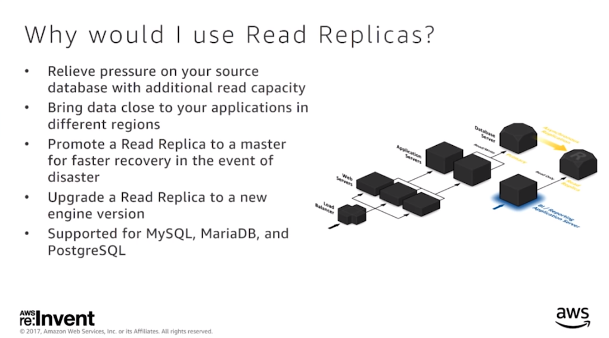
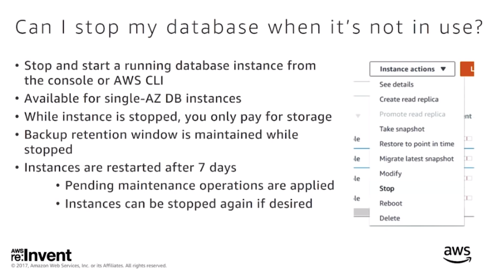
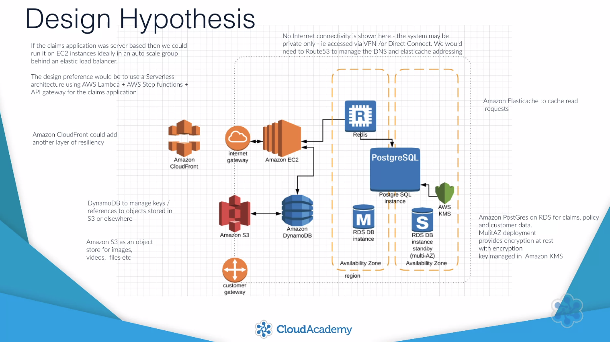

# Overview of the AWS Database Services

## Introduction

## What is a Cloud Database

Scaling components of the service means you can alter memory, processor size allocated storage or IOPS individually without modifying other configurations you have set within your database.

### Security

Shared Responsibility Security Model

**Security of the cloud**
AWS is responsible for protecting the infrastructure that runs AWS services in the AWS  Cloud.
**Security in the cloud**
Your responsibility is determined by the AWS service that you use.

#### Manage Access to Amazon RDS

1. Run your DB instance in a VPC.
1. Use IAM policies to assign permissions that determine who is allowed to manage Amazon RDS resources.
1. Use security groups to control what IP addresses or Amazon EC2 instance can connect to your database.
1. Use SSL connections with DB Instances.
1. Use Amazon RDS encryption tyo secure DB instances and snapshots at rest.
1. Use security features of DB engine to control who can log in to the databases on a DB instance.

## Introduction to the AWS Database Services

### Comparing the AWS Database Services

### Relational Databases

1. Amazon RDS
   1. Aurora
      1. MySQL
      1. Postgres SQL
   1. Commercial
      1. Oracle
      1. SQL Server
   1. Community
      1. MySQL
      1. Postgres SQL
      1. MariaDB
1. Amazon Redshift (Data Warehouse)

### Non-Relational Databases

Every non-relational entity needs a **primary key**

1. Amazon Dynamo DB
   1. Key Value
   1. Document
1. Amazon ElastiCache
   1. In-Memory Data Store
      1. Redis
      1. Memcached
1. Amazon Neptune
   1. Graph

### AWS Migration Services

## Monitoring IO

1. Monitor BurstBalance
1. Monitor read/write IOPS to see of average IOPS is > than the baseline.

## High Availability

Replication is at the block level. **To trigger fail-over reboot DB instance**.

How do I ensure database high availability

What happens during a a Mutli-AZ fail-over

Why would I used Read Replicas

When should I use Multi-AZ as opposed to Read Replicas

## Backup

How does Amazon RDS manage backups

To speed restore use an instance class with high I/O capacity. Maximize the I/O during the restore process.

## RDS Security

How do I secure my amazon RDS database?

How do I encrypt my database?

## Monitoring

How do I monitor my Amazon RDS database?

Can I know when a service event happens?

Use SNS that RDS will publish events to.

### Amazon Performance Insights

How do I improve database performance

### How do you maintain my database

### Database Pricing

How am I charged for Amazon RDS

Can I stop my database when its not in use?

## Amazon non Relational Databases in Depth

### Amazon DynamoDB

1. A cloud native database
1. Fully managed service
1. Supports document and key store object
1. Supports encryption at rest

### Amazon Elasticache

1. A fully managed service built from the open source Redis and Memcached database engines
1. Provides a front line cache to response to read requests made to an application or database

#### Amazon Elasticache for Redis

1. Need complex data types (strings, hashes, lists, sets, sorted sets, bitmaps)
2. Persistence is needed for your key store
3. Need to encrypt your cache data
4. Replication is required for cached data

#### Amazon Elasticache for Memcached

1. Simple model
1. Large nodes with multiple cores or threads
1. Require the ability to scale in/out and removing nodes as demand changes

Comparison Summary

### Amazon Neptune

Native graph database.

#### Supported Graph Models

1. Property Graph
1. W3C RDF

#### Supported Languages

1. Apache
1. TinkerPop
1. Gremlin
1. SPARQL

## AWS Relational Databases in Depth

1. Managed Service
1. The ability to Scale Components
1. Automatic Backups and Patching
1. Automatic Failure Detection and Recovery
1. High Availability (AZ)
1. **Replication across regions**

|Database|HA Technology|
|--------|---------|
|Oracle|Amazon fail-over technology|
|Postgres|Amazon fail-over technology|
|MariaDB|Amazon fail-over technology|
|Microsoft SQL Server|SQL Server mirroring|
|Amazon Auroa|Copy data in a DB cluster across multiple availability zones in a single region|

## Amazon RDS for MySQL

### MySQL High Availability & Fault Tolerance

1. Increase database size without downtime
1. Create Read Replicas and deploy across AZs
1. Point In Time Restore (Use InnoDB Storage Engine)
1. Snapshot restore (Use InnoDB Storage Engine)

## Amazon RDS for SQL Server

## Amazon RDS for Oracle Database

## Amazon RDS for MariaDB

## Amazon RDS for PostgresSQL

## Amazon RDS for Amazon Auora

## Amazon Aurora

- MySQL Compatible
- PostgreSQL Compatible
- Custom storage engine (Not EBS)

## Application Design Sample

## Amazon RDS Under the hood: Multi-AZ

The Multi-AZ feature is implemented using a replication layer installed between the database application and the Amazon Elastic Block Store (Amazon EBS) volumes. This layer handles application read and write requests and applies them in an environment where two discrete EBS volume copies are maintained—one accessed locally and one accessed remotely. This replication is synchronous.

The resynchronization process ensures that both copies of the data are restored to a consistent state. In an effort to reduce the time needed for resynchronization, the primary keeps track of blocks that are modified while the two instances are disconnected. When resynchronizing occurs, only those modifications need to be sent from the primary instance to the standby instance, which speeds up the process.

In the unlikely event that a volume experiences a failure, it is replaced with a new one. The process of replacement begins with securing a snapshot of the surviving volume. This is mainly for durability reasons, but it also helps improve the performance of the subsequent resynchronization of the volumes. The instance is then connected to the new volume and the volume is hydrated from the snapshot. Upon completion, the volumes are resynchronized and replication is restored.
