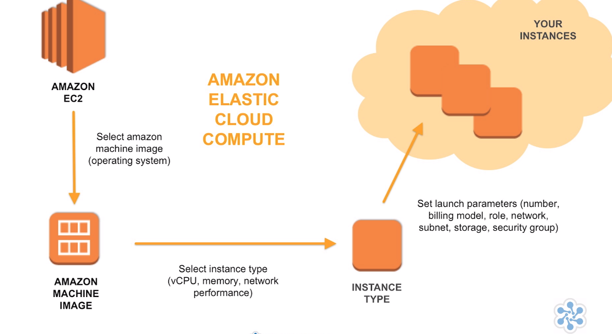

# Domain One: Designing Resilient Architectures

1. Domain Requirement
   1. Choose reliable/resilient storage
   1. Determine how to design decoupling mechanisms using AWS Services
   1. Determine how to design multi-tier architecture solution
   1. Determine how to design high availability and/or fault tolerant architectures

## Designing for Disaster Recovery / Business Continuity

### Disaster

#### Disaster Recovery Terminology

|Measure|Description|
|-|-|
|Recovery Time Objective|The time the system must by operational again|
|Recovery Point Objective|Acceptable amount of data loss represented as time|

RTO = 4 hour
RPO = 2 hours
System Down = 5:00 PM

System would need to operating by 9:00 PM (DOWN START TIME + RTO) with a restore of all of 3:00PM (DOWN START TIME - RPO)

#### Disaster Recovery Fail Back Process

Reversing the flow of data replication so that any data updates received while the primary site was down can be replicated back without loss of data.

#### Back up / Restore Scenario

##### Back up / Restore Scenario Description

Backup data to S3 and restore data from S3.

1. Restore data from S3 bucket as virtual tape.

##### Backup / Restore Considerations

1. Retention time
1. Security of Archives
1. Requires regular Disaster Recovery rehearsals
1. Requires fixity testing of recovered S3 files

##### Disaster Recovery Fail Back Process - Backup / Restore

1. Freeze data changes to DR site.
1. Take a backup
1. Restore the backup to the primary site.
1. Re-point users to primary site.
1. Unfreeze changes

#### Pilot Light Scenario

##### Pilot Light Scenario Description

Data is mirrored and the environment is scripted as a template which can be built out and scaled in the unlikely event of a disaster.

##### Pilot Light Scenario Considerations

1. Regularly run these servers, test them and apply any software updates and configuration changes to ensure they match our production environment.
1. Consider automating the provisioning of AWS services as much as possible with cloud formation.

##### Pilot Light Recovery

1. Start our systems from AMIs on the appropriate instance types.
1. Dynamic data servers resize them to handle production volumes as needed or add capacity accordingly.

##### Fail Back Process - Pilot Light

1. Establish reverse mirroring/replication from the DR site back to the primary site, once the primary site has caught up with the changes.
1. Freeze data changes to DR site.
1. Re-point users to the primary site.
1. Unfreeze the changes.

#### Warm Stand By Scenario

##### Warm Stand By Description

All key services are running but not at expected scale.

##### Warm Stand By Considerations

1. Patch and update software and configuration files in line with our live environment.

##### Warm Stand By Recovery

1. Environment will be scaled for production load.
1. DNS records will be changed to point to disaster recovery infrastructure.

##### Fail Back Process -  Warm Stand By

1. Establish reverse mirroring/replication from the DR site back to the primary site, once the primary site has caught up with the changes.
1. Freeze data changes to DR site.
1. Re-point users to the primary site.
1. Unfreeze the changes.

#### Multi-Site Scenario

##### Multi-Site Description

AWS environment duplicates production environment and DNS is used to route a subset of traffic to disaster recover site during normal operation. During normal data sources are in primary site during disaster recovery all functionality is contained within one site.

##### Multi-Site Considerations

Priority, recovery time and recovery point time are priorities and costs are not the main constraint.

##### Multi-Site Recovery

Traffic is cut over to the AWS infrastructure by updating the DNS record in Route 53.

##### Fail Back Process - Multi-Site

1. Establish reverse mirroring/replication from the DR site back to the primary site, once the primary site has caught up with the changes.
1. Freeze data changes to DR site.
1. Re-point users to the primary site.
1. Unfreeze the changes.

#### Replication

##### Replication Considerations

1. Distance between the sites
1. Available bandwidth
1. Data rate required by your application
1. Replication Technology

##### Synchronous Replication

##### Asynchronous Replication

#### Data Recovery Services

##### AWS Import Export

AWS import/export bypasses the internet and transfers your data directly onto and off of storage devices by means of high-speed internal networks at Amazon. For datasets of large size, AWS import/export is often faster than Internet transfer and more cost effective than upgrading your connectivity. And you can use AWS import/export to migrate data in and out of Amazon S3 buckets and Amazon Glacier Vaults or into Amazon EBS snapshots.

##### AWS Storage Gateway

AWS Storage Gateway is a service that connects an on-premise software appliance with cloud-based storage to provide seamless and highly secure integration between your on-premise IT environment and the storage infrastructure of AWS. AWS Storage Gateway supports three different configurations.

1. Stored Volume Gateways
1. Cached Volume Gateways
1. VTL Gateways

#### Disaster Recovery Summary

## The AWS Well Architected Framework

### Operational Excellence Pillar

### Security Pillar

### Reliability Pillar

### Performance Efficiency Pillar

### Cost Optimization Pillar

## Designing Solutions for Elasticity and Scalability

### Regions And Availability Zones

- Region -> \* Availability Zones -> \* Data Centers
- US East (N Virgina) -> us-east-1[a-Z]

### Naming Regions

1. Friendly Names -> US East (N Virgina)
1. Code Name -> us-east-1

### Edge Locations

CDN

### Regional Edge Cache

Sits between edge locations and origin

## Amazon Virtual Private Cloud

VPN

### Important Facts

VPC Related LIMITS

|Description|Limit|
|-|-|
|VPC CIDR Block|/16 -/28|
|Subnet CIDR Block|/16 - /28|
|VPCs / Region|5|
|Subnets / VPC|200|
|IPv4 CIDR blocks per VPC|5|
|NACLs / VPC|200|
|Rules / NACL|20|

### Internet Gateway

Internet Gateway

### Direct Connect

### NACL(s) Network Access Control Lists

- Stateless (egress & ingress) tables
- Default Action is DENY but default NACL is (ALLOW)
- Rules ordered by Rule Numbers (ASC)
- one -> many (NACL -> subnet), one -> one (subnet -> NACL)
- Operates @ subnet Level

### Security Group

- Stateful (egress & ingress) tables
- Operates @ instance level (Virtual Firewall) associated Network Interfaces.
- Can reference other Security Groups as sources
- DEFAULT is DENY traffic ingress and ALLOW traffic egress
- many -> many (SG -> NIC)

## Elastic LB

- ELB increase availability and fault tolerance of a system
- ELB can balance across many AZ
- ELB is a managed service
- ELB can be external or internal facing
- ELB does NOT STOP or START instances Autoscaling Service does that
- ELB monitor the health of instances and stops sending request to unhealthy instances
- ELB can support LB / Application Generated Cookie Stickiness
- ELB can do SSL Termination / Offloading

### ELB Limits

|Description|Limit|
|-|-|
|LB / Region|20|
|Target Groups / Region|3000|
|Listeners / LB|50|
|Targets / LB|1000|

### ELB API Model

1. LB
   1. Listener
      1. Target Group (Health Check)
         1. EC2
         1. IP
            1. Use any IPv4 address from the LB VPC CIDR for targets within load balancers VPC
               1. Peered VPC
               1. EC2-Classic
               1. Direct Connect
               1. VPN
         1. ECS (Elastic Container Service)
         1. EKS (Elastic Kubernetes Service)

### Metrics & Access Logs (ELB)

- Measure Latency

### Pricing

Hourly Cost - $16.00 / Month

LCU (LB Capacity Units) Bill on the MAX(Action)
|Action|Limit|Time|
|-|-|-|
|New Connections|25| / Second|
|Active Connection|3000|At once|
|Bandwidth|2.22|Mbps|
|Bandwidth|1 GB|/ hour|
|Rules Evaluation|1000|

### Load Balancing And AZ

When you enable an Availability Zone for your load balancer, Elastic Load Balancing creates a load balancer node in the Availability Zone. If you register targets in an Availability Zone but do not enable the Availability Zone, these registered targets do not receive traffic.

Example Load Balancing Across Multiple AZs

### Cross Zone Load Balancing

The nodes for your load balancer distribute requests from clients to registered targets. When cross-zone load balancing is enabled, each load balancer node distributes traffic across the registered targets in all enabled Availability Zones.

Example Cross Zone Load Balancing

### ELB Types

#### Classic LB

Previous generation for HTTP, HTTPS, TCP

#### Network LB (TCP / UDP)

- **Layer 4 Traffic**
- Connection-based load balancing
- Incoming client connection bound to server
- Load Balancing TCP Traffic
- Makes a single IP Address available per AZ
- Built for performance
- Preserve Source IP Address
- EIP Support enable Static IP which is ideal for firewalls and zero billing use cases
- HyperPlane enabled therefore support 1,000,000+ of requests per sec
- Ideal for applications with long running connections
- Same model as Application LB
- Preserve source IP (Proxy Protocol V2)

##### Network LB  Traffic and Capacity Metrics

|Name|Description|
|-|-|
|ActiveFlowCount|Total # of concurrent TCP flows|
|NewFlowCount|Total number TCP flows established|
|ProcessedBytes|Total # of bytes processed|

#### Application LB

- **Layer 7 Traffic**
- Host Based And Path Based Routing
- Connection terminated at the LB and pooled to the server
- ECS Integration
- SSL offloading
- SSL Termination
- WebSockets (Duplex Connection)
- HTTP/2
- LB deletion protection
- Redirects
  - HTTP - HTTP
  - HTTP - HTTPS
  - HTTPS - HTTPS
- Fixed Response
  - Control which of the client requests should be served by the application fleet.
  - LB can auto respond to HTTP request based on any criteria supported by content-based routing rules
  - Configure response codes and custom error messages to be returned to the clients
- X-Forwarded-For client IP address

##### Application LB Content-based Routing

1. Route based on path or host field in the HTTP header
1. Support multiple domains using a single load balancer
1. Route each path or hostname to a different target group

##### Slow Start (DISABLED BY DEFAULT)

- Add new targets without overwhelming them with a flood of requests
- LB linearly increases the number of requests sent to a new target
- Allows targets to warm before receiving their fair share of requests
- Useful for applications that depend on cache warming for optimal performance

##### Security

###### Legacy TLS

###### ALB TLS

###### ALB AWS Certificate Manager TLS

###### Predefined Security Policies

Security Policy is a combination of protocols and ciphers. The protocol establishes a secure connection between a client and a server and ensures that all data passed between the client and your load balancer is private. A cipher is an encryption algorithm that uses encryption keys to create a coded message. Protocols use several ciphers to encrypt data over the internet.

|Policy|Supports|
|-|-|
|ELBSecurityPolicy-TLS-1-1-2017-01|TLS 1.1|
|ELBSecurityPolicy-TLS-1-2-2017-01|TLS 1.2|
|ELBSecurityPolicy-2016-08 - New Default Policy|Classic LB default policy|
|Windows XP Security Policy||
|ELBSecurityPolicy-FSA-2018-06|Ciphers that ensure Forward secrecy|
|ELBSecurityPolicy-TLS-1-2-Ext-2018-06|Strictly TLS 1.2|

###### Application LB AWS WAF

Supports integration with Web application Firewall.

###### Server Name Indication (SNI)

Server Name Indication (SNI) is an extension to the Transport Layer Security (TLS) computer networking protocol by which a client indicates which hostname it is attempting to connect to at the start of the handshaking process. This allows a server to present multiple certificates on the same IP address and TCP port number and hence allows multiple secure (HTTPS) websites (or any other service over TLS) to be served by the same IP address without requiring all those sites to use the same certificate. It is the conceptual equivalent to HTTP/1.1 name-based virtual hosting, but for HTTPS. The desired hostname is not encrypted in the original SNI extension, so an eavesdropper can see which site is being requested.

1. Host multiple TLS secured applications, each with its own TLS certificate
1. Bind multiple certificates to the same secure listener on your LB
1. ALB will automatically choose the optimal TLS certificate for each client
1. Supports ECDSA

###### Authentication in Application LB

- Authenticate users accessing applications
- Native integration with any OIDC compliant IDPs
- Authenticate with Social Identities Integration with Amazon Cognito
- Authenticate with Enterprise IDPs with SAML

###### NetFlix Authentication Application LB Architecture

### AWS Elastic LB Decision Table

|Feature|Type Of ELB|
|-|-|
|Support Elastic IP|Network LB|
|SSL Cipher|Classic LB|
|Integrate ECS or container Services|Network or Application LB|
|SSL Offloading|Application or Classic LB|

## Amazon Elastic Cloud Compute

1. Select AMI
1. Select Instance Type
1. Launch Parameters

### AMI(s)

1. AWS AMI(s)
1. AWS Partner AMI(s)
1. Community AMI(s)
1. Snapshots of your custom VM(s)

### Instance Type Size

- nano
- micro
- small
- medium
- large
- xlarge
- (x)xlarge

### Instance Type

- General Purpose
  - Balance of compute, memory, and networking resources
- Compute Optimized
  - Compute-bound applications that benefit from high-performance processors.
- Memory Optimized
  - Designed to deliver fast performance for workloads that process large data sets in memory
- Storage Optimized
  - Designed for workloads that require high, sequential read and write access to very large data sets on local storage.
- Accelerated Computing
  - High processing capability, you'll benefit from using accelerated computing instances, which provide access to hardware-based compute accelerators such as Graphics Processing Units (GPUs) or Field Programmable Gate Arrays (FPGAs).
- Elastic GPU
  - Attach low-cost graphics acceleration to a wide range of EC2 instances over the network

#### Instance Type Attributes

- vCPUs
- Memory
- Storage
- Network | Optimization
- EBS | Optimized

### EBS

### Storage for Root Device

- "Instance Store" backed AMI.
  - Slow to start AMI
  - Supports TERMINATED, RUNNING NOT STOPPED
  - Ephemeral data is lost on STOPPED on REBOOT data is still available
  - S3 Template Backed
  - Attributes are fixed
- "EBS" backed AMI
  - Fast to start
  - Supports TERMINATE, REBOOT, STOP
  - Ephemeral data is lost on TERMINATE
  - While STOPPED instance type, kernel, RAM disk and user data can be changed

### Purchasing option - Request Spot instances

Allows us to buy excess capacity from AWS. Capacity guarantees are not bounded by any SLA.

### IAM Roles

IAM roles for EC2 automatically deploy and rotate the AWS credentials for you when you start that instance.

### User Data

Bootstrap scripts

### Meta-data URL

___

<http://169.254.169.254/latest/meta-data>

___

### Delete on Terminate EBS - Volume

If false EBS will survive instance TERMINATION.

### EC2 Pricing

Great site to compare instance types and AMI <https://ec2instances.info>

- Billing Types
  - On-Demand Instances - Pay as you go
  - Spot Instances - Purchasing excess capacity from AWS
  - Reserved Instances  - Upfront Commitment
  - Scheduled Reserved Instances - Scheduled with Upfront Commitment

Pricing is determined per instance type and AMI.

EC2 usage are billed on one second increments, with a minimum of 60 seconds. Similarly, provisioned storage for EBS volumes will be billed per-second increments, with a 60 second minimum. Per-second billing is available for instances launched in:

1. On-Demand, Reserved and Spot forms
1. All regions and Availability Zones
1. Amazon Linux and Ubuntu

### EC2 STOP, REBOOT, TERMINATE

The key is that a reboot keeps the instance on the same host therefore a new public IP but the same private IP.

### Instance Recovery

Create an Amazon CloudWatch alarm that monitors an Amazon EC2 instance and automatically recovers the instance if it becomes impaired due to an underlying hardware failure or a problem that requires AWS involvement to repair. **Terminated instances cannot be recovered**. A recovered instance is identical to the original instance, including the instance ID, private IP addresses, Elastic IP addresses, and all instance metadata. If the impaired instance is in a placement group, the recovered instance runs in the placement group.

When the **StatusCheckFailed_System** alarm is triggered, and the recover action is initiated, you will be notified by the Amazon SNS topic that you selected when you created the alarm and associated the recover action. During instance recovery, the instance is migrated during an instance reboot, and any data that is in-memory is lost. When the process is complete, information is published to the SNS topic you've configured for the alarm. Anyone who is subscribed to this SNS topic will receive an email notification that includes the status of the recovery attempt and any further instructions.

### Placement Group

Logical grouping of instances to improve performance

Cluster (Low latency, high network throughput)

Spread (Distinct Racks - with own power and network)

Partition (Reduces likelihood of correlated hardware failures)

### Systems Resource Manager

## Elastic IP Address (EIP)

- EIP associated to AWS account
- EIP associated to network interface or instance
- Charged for use when EIP not associated to running instance
- Limit 5 EIP / REgion
- EIP specific to a region

## Simple Queue Service

- Fast, reliable, scalable message queue service
- Unlimited number of messages
- Messages can be encrypted using SSE / KMS
- SQS is PCI DSS Level 1 certified

### Defaults

|Attribute|Time|
|-|-|
|Default Visibility Timeout|30 seconds|
|Message Retention Period|4 days|
|Maximum Message Size|256 KB|

### Standard Queue

- Unlimited Throughput
- At least-Once Delivery
- Best-Effort Ordering

### FIFO Queue

- High Throughput
- Exactly-Once Processing
- First-In-First-Out Delivery

### Delay Queue

Delay queues let you postpone the delivery of new messages to a queue for a number of seconds. If you create a delay queue, any messages that you send to the queue remain invisible to consumers for the duration of the delay period. The default (minimum) delay for a queue is 0 seconds.

#### Visibility Timeout

Immediately after a message is received, it remains in the queue. To prevent other consumers from processing the message again, Amazon SQS sets a visibility timeout, a period of time during which Amazon SQS prevents other consumers from receiving and processing the message. The default visibility timeout for a message is 30 seconds. The minimum is 0 seconds. The maximum is 12 hours.

#### Difference Between Visibility Timeout and Delay Queue

#### Message Retention Period

The amount of time based on the messages are kept in the queue before being deleted. A message is retained for 4 days. The minimum is 60 seconds (1 minute). The maximum is 1,209,600 seconds (14 days).

#### Inflight messages Per Queue

For most standard queues (depending on queue traffic and message backlog), there can be a maximum of approximately 120,000 inflight messages (received from a queue by a consumer, but not yet deleted from the queue).

For FIFO queues, there can be a maximum of 20,000 inflight messages (received from a queue by a consumer, but not yet deleted from the queue). If you reach this limit, Amazon SQS returns no error messages.

## Amazon Route 53

Highly Available Domain Name System

- Geographical Routing
- DNS Fail-over
- Weighted Routing (Blue/Green Deployments)
- Route 53 allows fail-over of ELB(s) to use multiple regions
- Private EC2 DNS
- Route 53 Zones

## Amazon CloudWatch

Provides a means of monitoring your resources via a series of metrics which are individual to each service. Allows you to quickly react to events and dynamically adjust and availability or scalability issue.

### Concepts

1. Metrics: Time-ordered set of data points
1. Namespaces: Containers for metrics
1. Alarms:  An alarm watches a single metric over a specified time period, and performs one or more specified actions, based on the value of the metric relative to a threshold over time.

### Monitoring Modes

1. Basic Monitoring (Every 5 minutes)
1. Detailed Monitoring (Every 1 minute) Additional Cost associated.
1. Metrics are maintained for 2 weeks.

### Alarm States

1. OK (Inside threshold level)
1. Alarm (Outside of threshold level)
1. Insufficient data

### Actions

1. SNS topic
1. EC2 Actions - Stop, Terminate, Reboot, Recover

CloudWatch logging - CloudWatch can be used as a log aggregator.

### CloudWatch Agent

1. Collect more system-level metrics from Amazon EC2 instances across operating systems.
1. Collect system-level metrics from on-premises servers.
1. Retrieve custom metrics from your applications or services using the StatsD and collectd protocols.
1. Collect logs from Amazon EC2 instances and on-premises servers, running either Linux or Windows Server.

## Auto Scaling

Auto Scaling is a core component of increasing durability and availability on AWS. Auto Scaling enables you to provision based on actual demand rather than on estimated demand. Auto Scaling has health checking built-in and it can drop EC2 instances that are not responding and replace them newly spun up healthy versions. All of this functionality works across multiple availability zones within a region, helping you achieve high availability with minimal manual intervention

### Auto Scaling Components

#### Launch Template

A launch template is similar to a launch configuration, in that it specifies instance configuration information. Included are the ID of the Amazon Machine Image (AMI), the instance type, a key pair, security groups, and the other parameters that you use to launch EC2 instances. However, defining a launch template instead of a launch configuration allows you to have multiple versions of a template.

#### Launch Configuration

A launch configuration is an instance configuration template that an Auto Scaling group uses to launch EC2 instances.

#### Auto Scaling Group

An Auto Scaling group contains a collection of Amazon EC2 instances that are treated as a logical grouping for the purposes of automatic scaling and management. An Auto Scaling group also enables you to use Amazon EC2 Auto Scaling features such as health check replacements and scaling policies.

- Instance Types Supported
  - On-Demand
  - Spot Instances
- If multiple AZ(s) defined the desired capacity is distributed across AZ(s).

#### Scaling

Scaling is the ability to increase or decrease the compute capacity of your application. Scaling starts with an event, or scaling action, which instructs an Auto Scaling group to either launch or terminate Amazon EC2 instances.

#### Scaling Options

- Maintain current instance levels at all times
- Manual scaling
- Scale based on schedule
- Scale based on demand
  - Scaling policy types
  - |Policy|Definition|
    |-|-|
    |Target tracking|Increase or decrease the current capacity of the group based on a target value for a specific metric|
    |Step|Increase or decrease the current capacity of the group based on a set of scaling adjustments|
    |Simple|Increase or decrease the current capacity of the group based on a single scaling adjustment|
  - For an advanced scaling configuration, your Auto Scaling group can have more than one scaling policy.
  - Amazon EC2 Auto Scaling chooses the policy that provides the largest capacity for both scale out and scale in
- Scaling Cooldown Period
  - The cooldown period helps to ensure that your Auto Scaling group doesn't launch or terminate additional instances before the previous scaling activity takes effect.

##### Auto Scaling Termination

###### Default Termination Policy

1. Determine which AZ(s) have the most instances, and at least one instance that is not protected.
1. Determine which instance to terminate so as to align the remaining instances to the allocation strategy for the On-Demand or Spot Instance that is terminating, your current selection of instance types, and distribution across your N lowest priced Spot pools
1. Determine whether any of the instances use the oldest launch template. If there is one such instance, terminate it.
1. Determine whether any of the instances use the oldest launch configuration. If there is one such instance, terminate it.
1. After applying all of the criteria in 2 through 4, if there are multiple unprotected instances to terminate, determine which instances are closest to the next billing hour

###### Customizing the Termination Policy

1. OldestInstance
1. NewestInstance
1. OldestLaunchConfiguration
1. ClosetToNextInstanceHour
1. OldestLaunchTemplate
1. AllocationStrategy

##### Sample Scaling Architecture Target-Tracking, SQS

## Deployment Orchestration with AWS Elastic Beanstalk

### What is AWS Elastic Beanstalk

With Elastic Beanstalk, you can quickly deploy and manage applications in the AWS Cloud without having to learn about the infrastructure that runs those applications. Elastic Beanstalk reduces management complexity without restricting choice or control. You simply upload your application, and Elastic Beanstalk automatically handles the details of capacity provisioning, load balancing, scaling, and application health monitoring.

Core Components

#### Application

An Elastic Beanstalk application is a logical collection of Elastic Beanstalk components, including environments, versions, and environment configurations. In Elastic Beanstalk an application is conceptually similar to a folder.

#### Application Version

In Elastic Beanstalk, an application version refers to a specific, labeled iteration of deployable code for a web application. An application version points to an Amazon Simple Storage Service (Amazon S3) object that contains the deployable code, such as a Java WAR file. An application version is part of an application. Applications can have many versions and each application version is unique. In a running environment, you can deploy any application version you already uploaded to the application, or you can upload and immediately deploy a new application version. You might upload multiple application versions to test differences between one version of your web application and another.

#### Environment

An environment is a collection of AWS resources running an application version. Each environment runs only one application version at a time, however, you can run the same application version or different application versions in many environments simultaneously. When you create an environment, Elastic Beanstalk provisions the resources needed to run the application version you specified.

#### Environment Configurations

An environment configuration identifies a collection of parameters and settings that define how an environment and its associated resources behave. When you update an environment’s configuration settings, Elastic Beanstalk automatically applies the changes to existing resources or deletes and deploys new resources (depending on the type of change).

#### Environment Tier

When you launch an Elastic Beanstalk environment, you first choose an environment tier. The environment tier designates the type of application that the environment runs, and determines what resources Elastic Beanstalk provisions to support it. An application that serves HTTP requests runs in a web server environment tier. An environment that pulls tasks from an Amazon Simple Queue Service (Amazon SQS) queue runs in a worker environment tier.

#### Web Tier

Receives HTTP Requests

1. Route 53
1. Elastic Load Balancer
1. Auto Scaling
1. EC2 Instance
1. Security Groups
1. Host Manager
   1. To aid in the deployment of your application
   1. Collating different metrics and different events from EC2 instance
   1. Generating instance-level events
   1. Monitoring both application and log files and the application server
   1. Patch instance components
   1. Manage log files allowing them to be published to S3

#### Worker Tier

Receives SQS Requests

1. SQS Queue
1. Auto Scaling
1. IAM Service Role (Allows access to SQS)
1. EC2 Instances
1. Daemon (SQSD)

Summary Image

#### Configuration Template

A template that you can use as a starting point for creating unique environment configurations.

#### Platform

A platform is a combination of an operating system, programming language runtime, web server, application server, and Elastic Beanstalk components.

#### Applications

An application is a collection of different elements, such as environments, environment configurations, and application versions

### Deployment Options

#### Rolling Update

With rolling deployments, Elastic Beanstalk splits the environment's EC2 instances into batches and deploys the new version of the application to one batch at a time, leaving the rest of the instances in the environment running the old version of the application. During a rolling deployment, some instances serve requests with the old version of the application, while instances in completed batches serve other requests with the new version.

1. All at once (Default)
   - Disables rolling deployments and always deploys to all instances
1. Rolling
   - Enables standard rolling deployments
1. Rolling with additional batch
   - Launches an extra batch of instances, before starting the deployment, to maintain full capacity
1. Immutable
   - Immutable update - Immutable environment updates ensure that configuration changes that require replacing instances are applied efficiently and safely.

### Monitoring and Health Checks

#### Basic Health

1. High-level overview of Environment / 5 minute to CloudWatch
1. Checks configuration / health of all services involved in **environment**
   1. Route53 CNAME record points to ELB
   1. Correct Security Groups to allow port 80 INBOUND traffic
   1. SQS Queue being polled if worker tier

Health Colors

#### Health Checks

Web Tier

Health checks are sent to the Auto Scaling Group which in turn sends to each individual EC2 instance.

Worker Tier

- EC2 instance check
  - System Status Check
    - Host Check
      - Reboot instance to schedule VM on another host
      - What if AMI is setup for On-Demand Host?
  - Instance System Check
    - Guest Check

#### Enhanced Reporting

Health Colors

Every EC2 instances have a health agent installed. The health agent captures additional information such as system metrics and at a faster rate than basic reporting sending metrics as custom metrics to CloudWatch.
