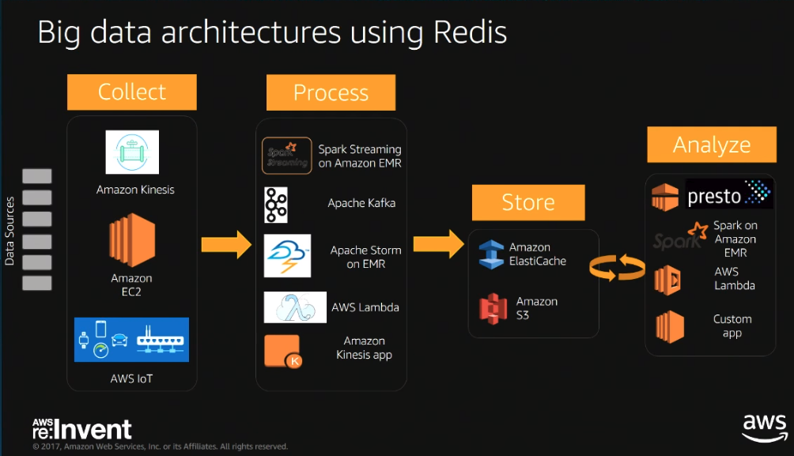

# Domain Two: Designing Performant Architectures

## Using AWS Storage for On-Premises Backup & Disaster Recovery

### Where does Cloud Storage fit in DR

1. Traditional Backup Methods Issues
   1. Data Availability Issues
   1. Scalability
   1. Costs
   1. Retrieval

1. Benefits of AWS Cloud Storage
   1. Offsite
   1. Scalable
   1. No CAPEX costs
   1. High durability and availability
   1. Enhanced security features

### Considerations when planning an AWS DR Storage Solution

Fit Purpose / DR compliance -> Balance in design

RTO -> Recovery Time Obj. (Max system downtime)
RPO -> Recovery Point Obj. (Max amount of time data could be lost)

Consider data going out and data going in.

1. Direct Connect
1. VPN Connection
1. Internet Connection
1. Large data transfer
   1. Snowball
   1. Snowmobile
1. Storage Gateway

Requirements

1. Speed
   1. Speed to restore data is based on your RTO
      1. E.g. Sorted by speed of retrieval (S3 -> Amazon Glacier Standard Retrieval)
   1. Connectivity
1. Durability
   1. S3
      1. (Order by durability and availability) Standard Class -> Infrequent Access -> Amazon Glacier)
      1. Life Cycle Management
1. Security (@Rest and @InTransit)
1. Compliance / Governance (Certifications && Regulations)
   1. AWS Artifact (AWS Governance Documentation)

### Using Amazon S3 as a Data Backup Solution

Availability and durability implemented by cross AZ(s) replication in a region across devices. Standard and Infrequent Access follow the same SLA

## Dynamo DB

Fully managed Schema-less NoSQL database service.

### Cost Components

1. Provisioned throughput / table
1. Storage Space

### Advantages

1. Fully managed
1. Flexible schema
1. Highly Available
1. Fast (Read && Write) -> Not constrained by size

### Disadvantages

1. Data is eventually consistent
1. No flexible query language
1. Limited Data Types (Strings, Numbers, Boolean, Binary)
1. Limitations
   1. 400 KB  max item
   1. 10 idx / table

Performance limited to provisioned throughput level

### Interacting with DynamoDB

1. Console
1. API / SQK (RPC Calls)
   1. Name
   1. Parameters
1. Supports transactions via Transact(Read|Write)Items operation
1. Supports TTL at  th table using attribute value

### Tables

Tables can have the following defined:

1. Name,
1. Provisioned ThroughPut
   1. Write Capacity Unit
   1. Read Capacity Unit
1. Primary Key (Partition Key)
   1. Primary key that uniquely identifies each item in the table
1. Sort Key (Key within Partition Key)
   1. They gather related information together in one place where it can be queried efficiently. Careful design of the sort key lets you retrieve commonly needed groups of related items using range queries with operators such as starts-with, between, >, <, etc.
   1. Composite sort keys let you define hierarchical (one-to-many) relationships in your data that you can query at any level of the hierarchy.

#### DynamoDB API Methods

1. Managing Tables
   1. Create Table
   1. Describe Table
   1. Update Table
   1. Delete Table
   1. List Tables
1. CRUD
   1. GetItem, PutItem, UpdateItem, DeleteItem
      1. Conditional UpdateItem
      1. Atomic Counters
   1. CRUD Batch
      1. BatchGetItem, BatchWriteItem (Create || Delete)
   1. Return Values
      1. PutItem -> ALL_OLD
      1. UpdateItem -> ALL_OLD, ALL_NEW, UPDATED_OLD, UPDATED_NEW
      1. DeleteItem -> ALL_OLD

##### Batch Operations

For applications that need to read or write multiple items, DynamoDB provides the BatchGetItem and BatchWriteItem operations. Using these operations can reduce the number of network round trips from your application to DynamoDB. In addition, DynamoDB performs the individual read or write operations in parallel. Your applications benefit from this parallelism without having to manage concurrency or threading.

The batch operations are essentially wrappers around multiple read or write requests. For example, if a BatchGetItem request contains five items, DynamoDB performs five GetItem operations on your behalf. Similarly, if a BatchWriteItem request contains two put requests and four delete requests, DynamoDB performs two PutItem and four DeleteItem requests.

In general, a batch operation does not fail unless all of the requests in the batch fail. For example, suppose you perform a BatchGetItem operation, but one of the individual GetItem requests in the batch fails. In this case, BatchGetItem returns the keys and data from the GetItem request that failed. The other GetItem requests in the batch are not affected.

#### Queries

The Query operation finds items based on primary key values. You can query any table or secondary index that has a composite primary key (a partition key and a sort key). You must provide the name of the partition key attribute, and a single value for that attribute. Query will return all of the items with that partition key value. You can optionally provide a sort key attribute, and use a comparison operator to refine the search results.

The Query operation finds items based on primary key values. Results can be limited to a range of sort keys. Results can be filtered on any attributes. Results can be ordered by sort key. Queries can be strongly consistent or eventually consistent.

#### Scans

A Scan operation reads every item in a table or a secondary index. By default, a Scan operation returns all of the data attributes for every item in the table or index. You can use the ProjectionExpression parameter so that Scan only returns some of the attributes, rather than all of them. A scan searches across all partition keys. Scans can be filtered on any attributes. Only eventually consistent reads are allowed. Scans can be run in parallel from multiple threads or servers.

#### Streams

A DynamoDB stream is an ordered flow of information about changes to items in an Amazon DynamoDB table. When you enable a stream on a table, DynamoDB captures information about every modification to data items in the table.

##### Understanding Provisioned ThroughPut

Amazon charges you based on the number of read capacity units and write capacity units that you allocate. Amazon will allow you to burst above your provisioned throughput occasionally. This lets you handle occasional spikes without having to worry too much. But the burst capacity they provide is very limited. Once that runs out, your requests will be throttled. Requests exceeding your capacity limit will be denied with an error called a provision throughput exceeded exception.

One (Read Capacity Unit) will allow you retrieve this / second

1. 1 Item
1. 4KB
   1. Records that are larger than 4KB cost 1 Read Capacity Unit / 4KB
1. Strong consistency
   1. Eventually consistent reads reduce cost of read

One (Write Capacity Unit) will allow you to write this / second

1. 1 Item
1. 1 KB
   1. Records that are larger than 4KB cost 1 Read Capacity Unit / 4KB

Changing Write Capacity Unit / Read Capacity Unit does not impact table availability or performance.

#### Understanding Secondary Indexes

A secondary index is a data structure that contains a subset of attributes from a table, along with an alternate key to support Query operations. You can retrieve data from the index using a Query, in much the same way as you use Query with a table. A table can have multiple secondary indexes, which gives your applications access to many different query patterns.

Local secondary indexes cannot be removed/changed without **removing** underlying base table.

##### Limits

1. 5 Global Secondary Indexes
1. 5 Local Secondary Indexes

##### Partitioning

When a table gets too large for DynamoDB to handle efficiently, it doesn't get slow or stop you from adding more data, instead, DynamoDB transparently splits your table into smaller segments or partitions. The partition key is used to determine which partition an item should be stored in. DynamoDB knows how to map partition keys to the physical partitions that hold the data on their servers so you don't need to think too much about the physical partitions themselves. When you have a table with a compound primary key all of the records with the same partition key are stored in the same physical partition, on the same DynamoDB server.

10G / Partition

###### The Number of Partition(s) Formula

1. Function of the table and the amount of I/O capacity.
1. Which ever value is the highest is the number of partitions for the table
   1. Storage Space / 10G
   1. (Read Capacity Units / 3000 + the Write Capacity Units / 1000)

1. Number of Partitions can never be reduced.
1. Natural growth means this will often be power 2
1. 1/2 of partition keys are split when growing partitions

###### Balancing Partitions in Large Tables

Read / Write Capacity is split evenly across partitions.

1. Issues caused when partition space is not evenly distributed.
   1. Provision throughput exceeded exception will be thrown
   1. Burst Capacity for each table (Used for background tasks)

1. Solutions
   1. Add more Read / Write Capacity
   1. Ensure partition key is well balanced

### Deep-Dive Dynamo-DB

1. Composite Keys
1. Hierarchial Data
1. Relational Modeling

|SQL|NoSQL|
|-|-|
|Optimized for storage|Optimized for compute|
|Normalized/relational|Denormalized/Hierarchical|
|Ad hoc queries|Instantiated Views|
|Scale Vertically|Scale horizontally|
|OLAP|OLTP at scale|

### DynamoDB Tables

1. Have to a partition key
   1. Partition key is spread across a key-space
1. Can have a sort key
1. Partitions are three-way replicated
1. Consistent reads always go against the master node
1. Eventually consistent reads can be sent to any replica node therefore cheaper in cost.

#### Local Secondary Indexes

1. Alternate sort key attribute
1. Index is local to a partition key
1. Strongly consistent

#### Global Secondary Indexed

1. Alternate partition and/or  sort key
1. Index is across all partition keys
1. Use composite sort keys for compound indexes
1. Eventually consistent

#### DynamoDB - Key Concepts

1. Selecting a partition key
   1. Large number of distinct values
   1. Items are uniformly requested and randomly distributed
1. Selecting a sort key
   1. Model 1:n and n:n relationships
   1. Efficient/selective patterns
   1. Leverage range queries
1. Hierarchial Keys - Composite Key

### DynamoDB - Queries / Filters

1. Sort Condition -> Before Read (Reduces RCU)
1. Filter Condition -> After Read

### DynamoDB Sample Modeling Session

#### ERD

#### Access Patterns

#### Relational

#### NoSQL Approach

#### Orders And Drivers GSI1

#### GSI2

## Elasticache Service

 Amazon ElastiCache is a web service that makes it easy to deploy, operate, and scale an in-memory data store or cache in the cloud. This service improves the performance of web applications by allowing you to retrieve information from fast, managed in-memory data stores, instead of relying entirely on slower, disk-based databases. So, what does that mean? Let's take a look at caching, and then expand our discussion to in-memory caching environments in the cloud.

1. Supported Engines
   1. Memcached
   1. Redis

## AWS re:Invent 2017: ElastiCache Deep Dive: Best Practices and Usage Patterns (DAT305)

### Patterns & Use Cases

Caching

Caching NoSQL

Caching NoSQL Serialization

Streaming data enrichment/processing

Big data architectures using Redis

Rate Limiting

### Best Practices

Cluster sizing best practices

Use the Redis Benchmark tool to measure performance.

Eviction Policy When Max Memory Is Reached

Redis Cloudwatch Metrics

