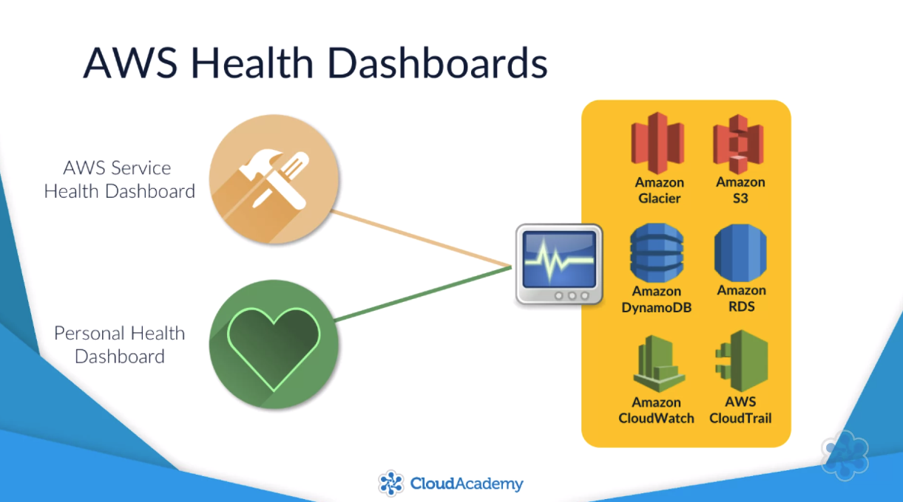
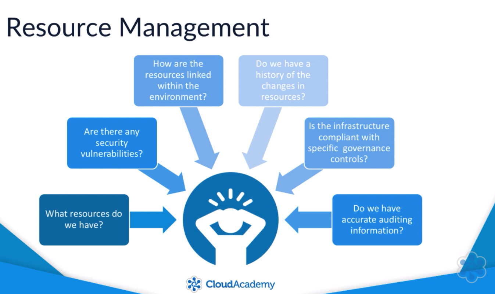
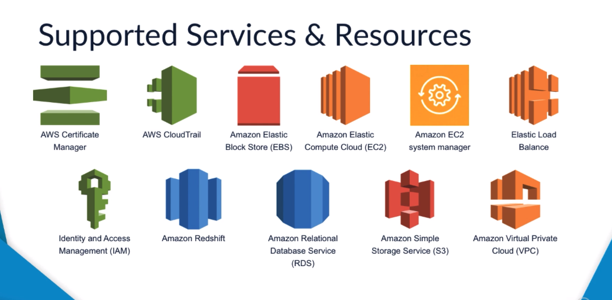
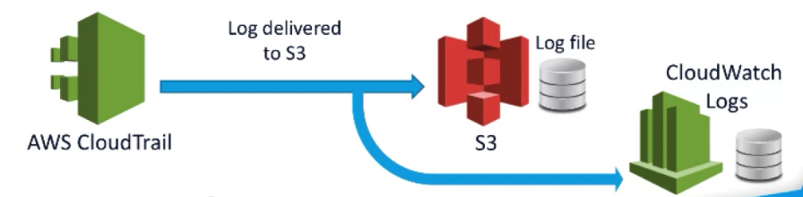
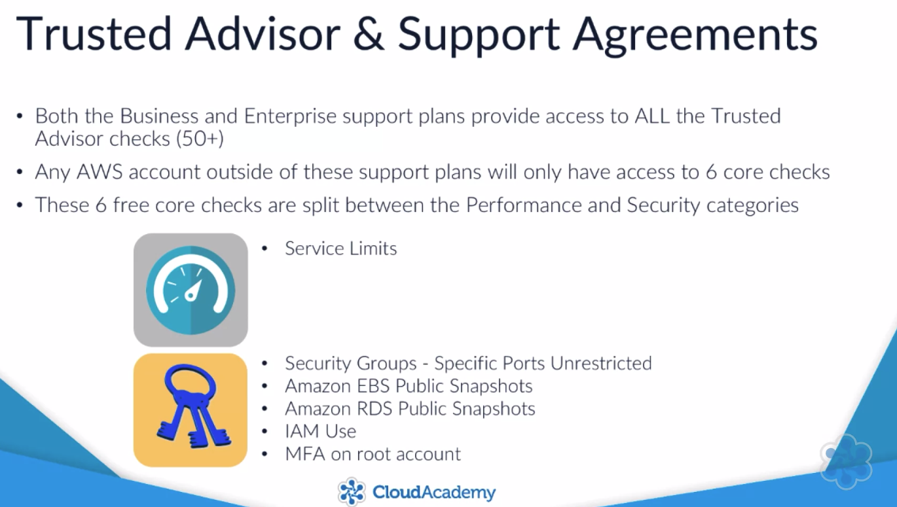
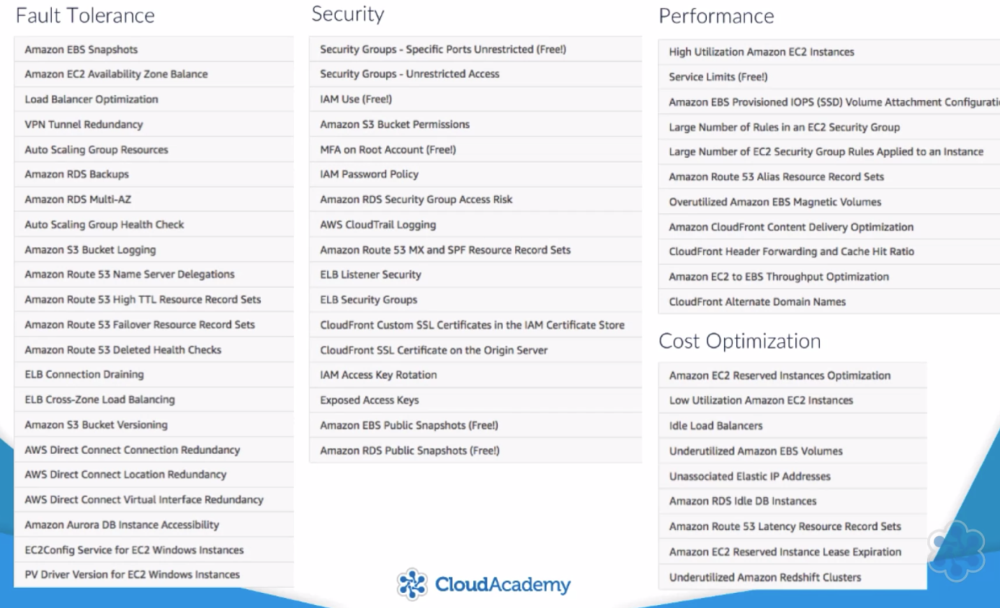
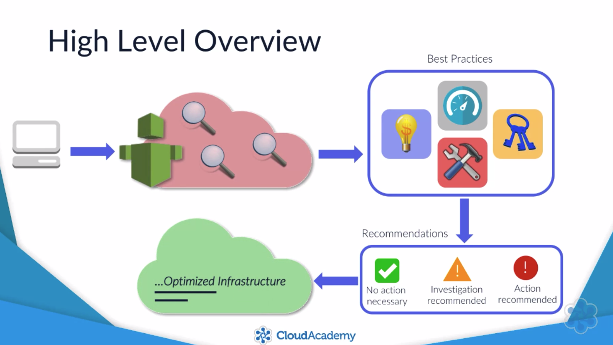

# Management Fundamentals

## AWS Personal Health Dashboard

1. AWS Service Health Dashboard
   1. Provides a complete a health check of all services in all regions
   1. <http://status.aws.amazon.com>
   1. Service Health Status
      1. Service is operating normally
      1. Informational message
      1. Service degradation
      1. Service disruption
   1. Ability to view the Service status of each service within each region for the past year.
1. Personal Health Dashboard
   1. Notifies you of any service interruptions that may affect the resources and services that you are using within your AWS account.
   1. <https://phd.aws.amazon.com>

AWS Health Dashboards

## AWS Config

Resource Management

1. Capture Resource changes
1. Act as resource inventory
1. Store configuration history
1. Provide snapshot of configurations
1. Notification about changes (Simple Notification Service)
1. Provide AWS CloudTrail integration (Who, What, When, API used to make configuration change)
1. Use Rule to check compliancy
1. Security analysis
1. Identify relationships

Supported Services Resources

## AWS CloudTrail

1. Record and tracks all Application Programming Interface API requests in your AWS Account.
1. Request can be initiated from:
   1. SDKs
   1. AWS CLI
   1. AWS Management Console
   1. Another AWS Service

CloudTrail Events

1. Every API request captured is recorded as an 'event'
1. Multiple events are records within CloudTrail Logs
1. Events contain an array of associated metadata:
   1. Identity of caller
   1. Timestamp of request
   1. Source IP Address

CloudTrail Logs

1. New log files are created every 5 minutes
1. Log files are delivered and stored with S3
1. Log files can be stored as long as required allowing you to review the history of all API requests

CloudTrail Log files can also be delivered to CloudWatch Logs for metric monitoring and alerting via SNS.

CloudTrail Infrastructure

- Effective for security analysis
  - Monitor restricted API calls
  - Notification of thresholds breaches
- Resolve day to day operational issues
- Track changes to your AWS infrastructure
  - AWS Conflict is a service specifically designed to give visibility to resource changes.
- CloudTrail logs can be used as evidence of various compliance and governance controls
  - ISO
  - PCI DSS
  - FedRamp
- Security at Scale: Logging in AWS => How AWS CloudTrail can you achieve compliance by logging API calls and changes to resources. (To READ)

## Amazon Trusted Advisor

AWS Trusted Advisor recommends improvements based on best practices across your account.

AWS Trusted Adviser Categories

1. Cost Optimization
1. Performance
1. Security
1. Fault Tolerance

Trusted Advisor & Support Agreements

Enterprise Support Plan

Business & Support Plan Benefits

1. Ability to administer certain functions of Trusted Advisor using the AWS Support API
1. Ability to track the most recent changes to your AWS account by brining them to the top of your AWS trusted advisor.

Trusted Advisor Features

1. Trusted Advisor Notifications
1. Exclude Items
1. Action Links
1. Access Management
1. Refresh - Automatically 24 Hours

High Level Overview

## Amazon CloudWatch

Provides a means of monitoring your resources via a series of metrics which are individual to each service. Allows you to quickly react to events and dynamically adjust any availability or scalability issue.

Monitoring Modes

1. Basic Monitoring (Every 5 minutes)
1. Detailed Monitoring (Every 1 minute) Additional Cost associated.
1. Metrics are maintained for 2 weeks.

Alarm States

1. OK (Inside threshold level)
1. Alarm (Outside of threshold level)
1. Insufficient data

CloudWatch logging - CloudWatch can be used as a log aggregator.
