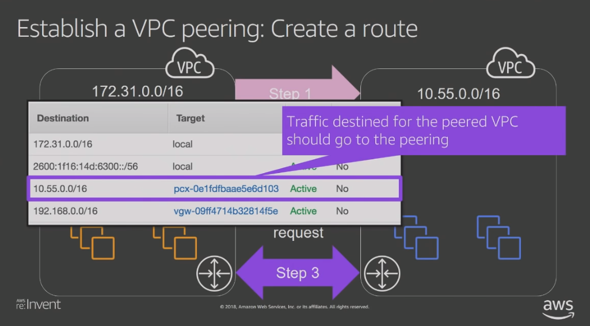
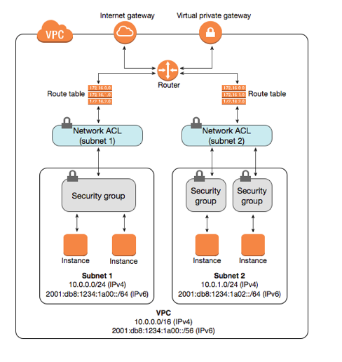

# Networking

## What is a VPC

Virtual Private Cloud

5 VPC / Region

VPC is an isolated segment of the AWS public cloud that allows you to provision and deploy resources in a safe and secure manner.

VPC CIDR Block Ranges /16 -> /28

1. A route table can be assigned to multiple subnets.
1. A subnet can be assigned to one route table.

## Subnets

### Public Subnet

1. Resources must have public IP Addresses
1. Internet Gateway must be attached to VPC
1. Route to Internet Gateway must exist in routing table

Route table with the minimum entries

|Destination|Target|Meaning|
|-|-|-|
|10.0.0.0/16|local|Traffic across VPC|
|0.0.0.0/0|igw-21268a45|Internet bound traffic|

### Private Subnet

|Destination|Target|Meaning|
|-|-|-|
|10.0.0.0/16|local|Traffic across VPC|

Subnet CIDR block must reside within the VPC CIDR block.

Example VPC -> 10.0.0.0/16
Subnet 10.0.1.0/24 (256 IP Addresses)

### IP Address Reservations

|IP Address|Reserved For|
|-|-|
|10.0.1.0| Network|
|10.0.1.1|AWS Routing|
|10.0.1.2|AWS DNS|
|10.0.1.3|AWS Future Use|
|10.0.1.255|Broadcast Address|

## Network Access Control Lists (NACLs)

Associated with egress and ingres subnet traffic therefore all instances / resources inherit NACLs. By default all egress and ingress traffic is **DENIED**. NACLs are **stateless** meaning the egress and ingress traffic has to **ALLOWED or DENIED** explicitly. NACLs can be **shared** across subnets. There must be a NACL associated to a subnet.

The default NACL associated with a subnet allows all traffic by default. Custom NACL(s) by default DENY all traffic.

NACLs Rule Processing

1. Sort By Rule Numbers (ASC)
1. Apply attributes to match traffic (Port Range, Protocol, Source/Destination)
1. Pick the rule that matches or the default rule and apply ACTION attribute
1. No match select DEFAULT RULE *
1. No match ALLOW traffic

**(Rule #) * is the default rule to be selected if no rules are matched. It is best practice to add a default rule with action deny for all types, protocols, port ranges and sources.**

Inbound NACL

|Field|Purpose|
|-|-|
|Rule #|Rule Number|
|Type|Traffic Type|
|Protocol|Traffic Protocol|
|Port Range|Port Range|
|Source|Source IP|
|Allow/Deny|Action|

Outbound NACL

|Field|Purpose|
|-|-|
|Rule #|Rule Number|
|Type|Traffic Type|
|Protocol|Traffic Protocol|
|Port Range|Port Range|
|Destination|Destination IP|
|Allow/Deny|Action|

## Security Group

Work at the instance level (Virtual Firewall) as compared to NACLs which operate at the subnet level. Security Groups are stateful which means rules do not be created for egress and ingress traffic. A Security Group ruleis are permissive allowing only ALLOW actions. If no rules match then a DENY action is executed.

DEFAULT Security Group is DENY traffic ingress unless from same Security Group and ALLOW all traffic egress.

Security Groups are associated to network interfaces.

When creating Security Group rules Source attribute can be the AWS ARN of another Security Group to enable cross security group communication.

|Field|Purpose|
|-|-|
|Type|Type|
|Protocol|Protocol|
|Port Range|Port Range|
|Source|Source IP|

Security Group Rule Processing

1. Evaluates all rules before deciding whether to ALLOW traffic
2. If match found ALLOW else DENY the request

## Gateways

Provide connectivity for access to networks outside the VPC. Examples of Gateways

1. NAT Gateway
1. Internet Gateway
1. Virtual Private Gateway

### NAT Gateway

Resides in a public subnet which has a route to the IGW (via subnet route table) and has a EIP. The private subnet points to the NAT gateway in its route table. NAT Gateway will deny all inbound traffic.

### Internet Gateway

Allows outbound traffic to the internet cloud and use NAT on all resources that have public IP addresses.

Internet Gateway

#### Bastion Hosts

A **hardened collection of EC2 instances** that are deployed to a public subnet with the following security group defined

|Type|Protocol|Port Range|Source|
|-|-|-|-|
|SSH|TCP|22|IP ADDRESS|

Security Group Around targets of Bastion jump-host

|Type|Protocol|Port Range|Source|
|-|-|-|-
|SSH|TCP|22|Security Group of bastion hosts sg-*|

Public Key Encryption

Store private key on source of connection while storing public key on each target of the source including bastion hosts and private subnet resources.

Enable SSH-Agent Forwarding so private keys do not need to be installed on jump hosts when authenticating to protected resources.

## VPN And Direct Connect

### VPN

Enable communication between private VPC subnet and custom data center.

Virtual Private Gateway -> Attached to your VPC
Customer Gateway -> Attached to your Data Center
VPN tunnel -> Communication between Virtual Gateway and customer Gateway

Example

1. Data Center -> 192.168.0.0/16
2. VPC -> 10.0.0.0/16

Private Subnet Routing Table
|Destination|Target|Description|
|-|-|-|
|10.0.0.0/16/|local|VPC Traffic|
|192.168.0.0/16|vgw-*|Virtual gateway traffic with CIDR address of Data Center|

#### VPN Routing

##### Dynamic Routing

If (BGP) Border Gateway Protocol is enabled on the Customer Gateway then route table propagation will occur so your route table in the private subnet will see routes via BGP.

##### Static Routing

You add routes manually to the route table of the private subnet.

###### Security Groups Private Subnet Resources

Allow traffic coming in from remote data center and if DENY NACLs have been defined then add the appropriate NACLs for data center communication.

### Direct Connect

Connects directly to Region via private infrastructure owned by AWS Direct Connect partner.

1. Private Interface (VPC) ->
   1. Dedicated network route to direct connect partner
   1. Virtual Private Gateway
1. Public Interface (AWS Services) ->
   1. Dedicated network route to direct connect partners

Uses 802.1q VLAN and IPSEC to create the VPN tunnel.

### VPC Peering

Allows you to connect to other VPCs across Regions. VPC peering is run on AWS infrastructure therefore possess High Availability and redundancy. VPC peering is a one to one relationship and is not transitive. VPC Peering can be established across Regions and must not have overlapping CIDR address ranges.

|IP|Role|
|-|-|
|10.0.0./16|Requestor|
|172.31.0.0/16|Acceptor|

Flow

1. Requestor -> Acceptor
1. Acceptor -> Requestor (Peered Connection Created)
1. Route Table Changes
1. Security Groups

Requestor - Route Table

|Destination|Target|Description|
|-|-|-|
|10.0.0.0/16|local|Inter-VPC Traffic|
|172.31.0.0/16|pcx-*|Peering connection|

Acceptor - Route Table

|Destination|Target|Description|
|-|-|-|
|172.31.0.0/16|local||Inter-VPC Traffic|
|10.0.0.0/16|pcx-*|Peering Connection|

### Transit Gateway

Spoke Model - Central HUB

1. Centralization of Management
1. Simplifies network connection management.
   1. VPC Peering
   1. Route Table Management
   1. Supports Direct Connect Gateway
   1. VPN Gateway

## Network Security General High Level

## VPC Endpoint

A VPC endpoint enables you to privately connect your VPC to supported AWS services and VPC endpoint services powered by PrivateLink without requiring an internet gateway, NAT device, VPN connection, or AWS Direct Connect connection. Instances in your VPC do not require public IP addresses to communicate with resources in the service. Traffic between your VPC and the other service does not leave the Amazon network.

### VPC Interface Endpoint

An interface endpoint is an elastic network interface with a private IP address from the IP address range of your subnet that serves as an entry point for traffic destined to a supported service.

### VPC Gateway Endpoint

A gateway endpoint is a gateway that you specify as a target for a route in your route table for traffic destined to a supported AWS service. The following AWS services are supported:

1. Amazon S3
1. DynamoDB

## Elastic IP Static IP Address

An Elastic IP address is associated with your AWS account. With an Elastic IP address, you can mask the failure of an instance or software by rapidly remapping the address to another instance in your account.

An Elastic IP address is a public IPv4 address, which is reachable from the internet. If your instance does not have a public IPv4 address, you can associate an Elastic IP address with your instance to enable communication with the internet; for example, to connect to your instance from your local computer.
