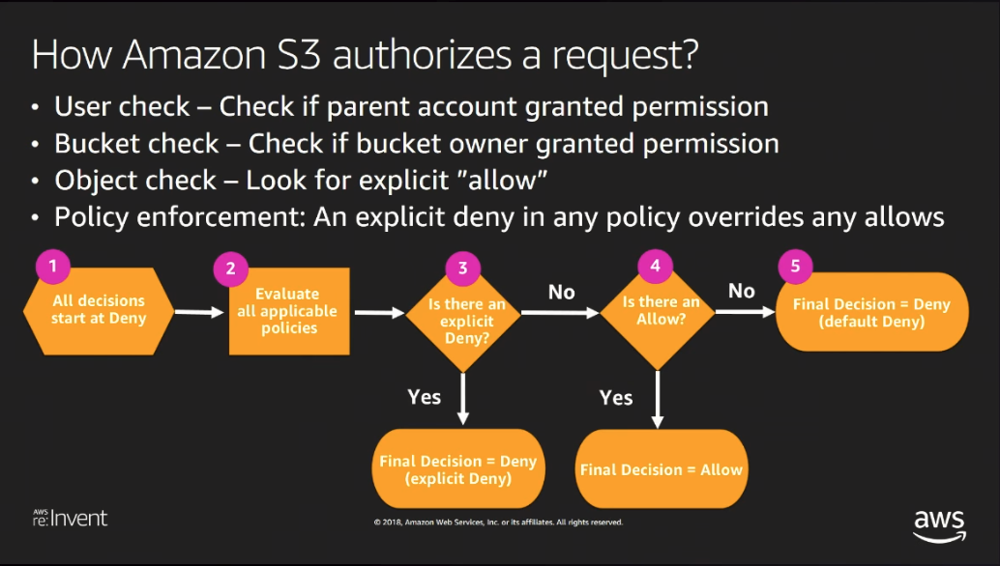
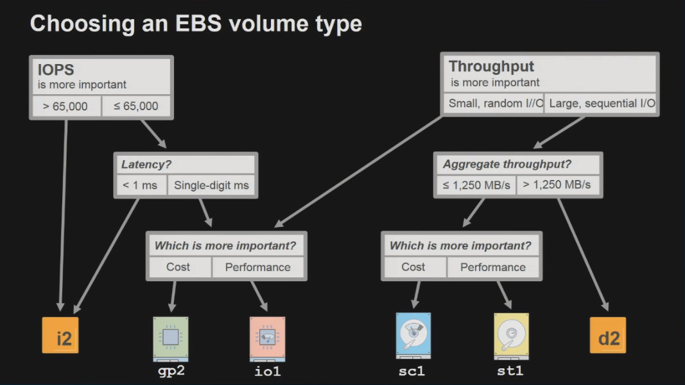

# Storage Services

## CloudFront


### Purpose

1. Acts as a CDN (Content Delivery Network)
1. Distributes data requested through web traffic closer to the end user via edge locations

### Definitions

#### Objects

1. Request Properties + Configuration produces Content which has a cache key
   1. Static, long-lived
      1. Use high TTL value
      1. Use versioning to update a new version of the content
   1. Static, short-lived
   1. Dynamic

#### Static Content

1. Use cache-control header per object
   1. Use cache-control (public, max-age=?, s-maxage=?)
1. To override origin use cache behaviors

#### Dynamic Content

1. Use cache-control header per object
    1. Use cache-control: private, no-store
1. To override origin use cache behaviors

### Viewer Connection

1. Use Keep-alive
1. TLS handshake
   1. Support session tickets
1. Enable gzip compression
1. HTTP/2
   1. Multiplexed - Multiple request/response in flight
   1. Header Compression

#### Origin Connection

1. Use Keep-alive
1. TLS handshake
   1. Support session tickets
1. Enable gzip compression
1. HTTP/2
   1. Multiplexed - Multiple request/response in flight
   1. Header Compression
1. Tune Origin timeouts
   1. Read timeout
   1. keep-alive timeout

### Edge Locations

1. AWS edge locations are sites deployed into highly populated areas across the globe
1. Edge locations are not used to deploy infrastructure
1. Edge locations allow the ability to cache data and reduce latency for end users

### Path of Request

1. CloudFront Edge Location
1. Regional Edge Cache
    1. As objects expire from an Edge Location a Regional Edge Cache will continue to cache the content since it has a large cache width
1. Origin

### Distributions

CloudFront uses distributions to control which source data it needs to redistribute and to where.

1. Web Distribution
   1. Used to distribute both static and dynamic content
   1. Uses both the HTTP and HTTPS protocol
   1. Allows you to add, remove and update objects
   1. Ability to provide live stream functionality on your website
   1. Uses an 'origin' to define where the source data is coming from
      1. S3 bucket
      1. EC2 Instance
1. RTMP Distribution
   1. Used to distribute streaming media using Adobe Flash media server's RTMP protocol
   1. Source data must be a S3 bucket
1. **Cannot serve Adobe Flash multimedia content over HTTP or HTTPS**

#### Distribution Configuration

1. Select the origin location
1. Specific caching behavioral options
1. By default content is 24 hours before it expires
1. Define the distribution settings
   1. US, Canada and Europe
   1. US, Canada, Europe and Asia
   1. All edge locations

#### Security

1. Your distribution can be associated to a web application firewall access control list and get web application protection. <https://cloudacademy.com/course/aws-web-application-firewall/>
1. Encryption can be enabled by using SSL encryption

#### Pricing

1. Additional pricing
   1. Field-level Encryption
   1. Invalidation Requests
   1. Dedicated IP Custom SSL (When you cannot use SNI (Server Name Indicator Field))
1. Transfer between Amazon S3 to CloudFront is free.
1. Price Class - Limit edge locations (Reduce Price)
1. Reserved Capacity Pricing commit to usage level of at least 12 months

Pricing metrics Region

---

Regional Data Transfer Out to Origin (per GB) HTTP POST, PUT Edge -> Origin

Request Pricing for All HTTP Methods (per 10,000)

Regional Data Transfer Out to Internet (per GB) Edge -> Client

SSL - Dedicated IP Custom SSL: 600.00

---

#### Reports

1. Cache Statistics - 60 days @ Edge Location
1. Popular Object - Top 50 Objects
1. Top Referrers
1. Usage - Data In/Out
1. Viewers Report - Agents

### Lambda@Edge CloudFront

#### Events

|Event Name|Event Description|
|-|-|
|Viewer Request||
|Viewer Response||
|Origin Request||
|Origin Response||

#### Difference Between Event Types

1. Viewer Events
   1. Triggered for every view request
   1. Cache key can be modified
   1. Response is not cached
1. Origin Events
   1. Triggered only for cache misses
   1. Cache key cannot be modified
   1. Response can be cached

#### Use Cases

1. Security
   1. Add security headers
1. Content Customization
1. Origin Selection
1. Response and Content Generation

#### Cache-Hit

1. Raise "Viewer Request"
1. CloudFront services the request
1. Raise "Viewer Response"

#### Cache-Miss

1. Raise "Viewer Request"
1. Raise "Origin Request"
1. CloudFront services the request by sending to origin
1. Raise "Origin Response"
1. Raise "Viewer Response"

## AWS Storage Services

### Data Storage Categorization

#### Block Storage

1. Data is stored in chunks known as blocks
1. Blocks are stored on a volume and attached to a single instance.
1. Provide very low latency data access.
1. Comparable to DAS storage used on premises.

#### File Storage

1. Data is stored as separate files with a series of directories.
1. Dat is stored within a file system
1. Shared access is provided for multiple users.
1. Comparable to NAS storage used on premises.

#### Object storage

1. Objects are stored across a flat address space.
1. Objects are referenced by a unique key.

## Amazon Glacier

1. A very low cost, long term, durable storage solution (cold storage) suited for long term backup and archival requirements.
2. It does not provide instant access to your data.
3. Attains 99.99999999999% of durability by replicating data across multiple availability zones within a single region.
4. Storage costs are considerably lower than Amazon S3.
5. Retrieval of your data can take several hours.

### Vaults & Archives

#### Vaults

1. Vaults act as a container for Glacier Archives.
2. Vaults are regional.
3. Within each vault you can store data as archives.

#### Archives

1. Archives can be any object similarly to S3
2. You can have unlimited archives within Glacier Vaults.

### Glacier Dashboard

1. Only allows you to create vaults
2. Any operation process to upload or retrieve data HAS to be done using code:
   - The Glacier web service API
   - AWS SDKs

<https://docs.aws.amazon.com/amazonglacier/latest/dev/amazon-glacier-api.html>
<https://docs.aws.amazon.com/amazonglacier/latest/dev/using-aws-sdk.html>

### Moving Data

1. Create your Vault
1. Move Data
   1. API / SDK
   1. S3 life cycle rule

### Data Retrieval

1. Create an archival retrieval job. Request is an access to all or part of the archive.
2. Specify a retrieval option
   1. Expedited
      - Used for urgent access to a subset of an Archive
      - Request has to be less than 250M
   2. Standard
      - Used to retrieve any of your Archives
   3. Bulk
      - Used to retrieve petabytes of data
      - Cheapest

|Retrieval Option|Cost / Gig|Cost / Request|Execution Time|
|----------------|----------|--------------|--------------|
|Expedited|$0.03|$0.01|1 - 5 minutes|
|Standard|$0.01|$0.05 / 1000|3 - 5 Hours|
|Bulk|$0.0025|$0.025 / 1000|5 - 12 Hours|

### Amazon Glacier Security

Data is encrypted by default using the AES-256 encryption algorithm.

#### Vault Access Policies

- Resource based policies
- Applied to a specific vault
- Each vault can only contain 1 vault access policy
- Policy in in a JSON format
- Policy contains a principle component

#### Vault Lock Policies

<https://docs.aws.amazon.com/IAM/latest/UserGuide/reference_policies_evaluation-logic.html>

- Once set they cannot be changed
- Used to help maintain specific governance and compliance controls

### Amazon Glacier Pricing

Glacier offers a single storage cost for all data despite how much data you are storing.

### Amazon Glacier Deep Dive

- Amazon Macie
- Fixity Checking
- WORM (Write Once Read Many)

## Amazon Simple Storage Service (S3)

- Object based storage service.
- Largest file size supported = 5TB
- Object are uploaded to a region across AZ(s) with multiple copies in each AZ
- Objects stored in S3 have a **durability** 99.9999999999%.
- **Availability** of S3 data objects is 99.99%.

**Smallest object size is 0 bytes and largest size is 5TB.**

### Availability vs Durability

Availability refers the probability the service will be operational vs durability which is the probability the object will be available.

### S3 Buckets

- Objects are stored in a bucket that must be have a globally unique name.
- Objects can be uploaded into the bucket or folders within the bucket.
- A max of **100** buckets per AWS account can be created without needing AWS support to increase this amount.
- Objects have a unique object key identifying that object.
- Supports CRR (Cross Region Replication), by default disabled.
   1. Reduce Latency of Data Retrieval
   1. Governance and Compliance
- Performance
   1. Multipart upload allows you to upload a single object as a set of parts. Each part is a contiguous portion of the object's data. You can upload these object parts independently and in any order. If transmission of any part fails, you can retransmit that part without affecting other parts. After all parts of your object are uploaded, Amazon S3 assembles these parts and creates the object. In general, when your object size reaches 100 MB, you should consider using multipart uploads instead of uploading the object in a single operation.

### Storage Classes

1. Standard
1. Standard - IA (Infrequent Access)
1. Intelligent Tiering
1. One Zone - IA (Infrequent Access)
1. Reduced Redundancy Storage (RSS)

#### Frequently Accessed

1. Standard
1. RSS (Reduced Redundancy Storage) (Not recommended by AWS)

#### Infrequently Accessed

Ideal for data that can be easily regenerated. There is an additional cost to retrieve data compared to Standard. Offers the same access speed to that of Standard.

1. Standard - IA
1. One Zone - 1A
   1. Does not replicate across AZ(s).
   1. Is more cost effective than Standard - IA.
1. Intelligent Tiering
   1. Used for unpredictable access patterns.
   1. Consists of two tiers: Frequently accessed and infrequently accessed.
   1. Automatically moves data into appropriate tier based on access pattern.
   1. Objects must be larger than **128k**.

### S3 Security

1. IAM
   1. Assigned to roles, users and groups
1. Bucket Policies <https://cloudacademy.com/course/overview-of-aws-identity-and-access-management-iam/what-is-identity-and-access-management/>
   1. Permissions can be very specific using policy conditions.
   1. Provide added granularity to bucket access.
1. Access Control Lists
   1. ACLs only control access for users of your own AWS account, such as public access.
   1. ACLs are not as granular as bucket policies.
   1. The permissions are broad in access.
1. Data Encryption
    1. Server Encryption <https://cloudacademy.com/course/amazon-web-services-key-management-service-kms/>
       1. SSE-S3 (S3 Managed Keys)
       1. SSE-KMS (KMS managed Keys)
       1. SSE-C (Customer managed keys)
    1. Client Side Encryption
       1. CSE-KMS (KMS managed keys)
       1. CSE-C (Customer Managed keys)
    1. SSL
1. Life Cycle Policies
1. MFA Delete (Multi-Factor Authentication)
1. Versioning

Primary difference between server and client side encryption is where the encryption takes place.


#### Managing Access

##### Amazon S3 Resources: Buckets And Objects

1. Bucket SubResources
   1. life cycle
   1. website
   1. versioning
   1. policy amd ACL (access control list)
   1. CORS
   1. logging
1. Object SubResources
   1. ACL
   1. restore

By default, only the resource owner can access these resources. A bucket owner can grant cross-account permissions to another AWS account to upload objects.The AWS account that uploads objects owens those objects. With the exception of the following the bucket owner can

1. Can deny access to any objects or delete any objects in the bucket.
1. Can archive any objects or restore archived objects regardless of who owns them.

##### Ownership and Request Authentication

All requests to a bucket are wither authenticated or unauthenticated. Authenticated requests must include a signature value that authenticates the request sender, unauthenticated requests do not. A bucket owner can allow unauthenticated requests by having a public bicket policy, or when a bucket ACL grants WRITE or FULL CONTROL access to the All users group or the anonymous user specifically. If an object is uploaded to a bucket through an unauthenticated request, the anonymous user owns the object. The default ACL grants FULL_CONTROL to the anonymous user as the object's owner.

##### Resource Operations

<https://docs.aws.amazon.com/AmazonS3/latest/API/RESTBucketOps.html>
<https://docs.aws.amazon.com/AmazonS3/latest/API/RESTObjectOps.html>

##### Managing Access to Resources (Access Policy Options)

###### Resource-based policies

Bucket policies and access control lists (ACLs) are resource-based because you attach them to your Amazon S3 resource.


ACL

``` XML
<?xml version="1.0" encoding="UTF-8"?>
<AccessControlPolicy xmlns="http://s3.amazonaws.com/doc/2006-03-01/">
  <Owner>
    <ID>*** Owner-Canonical-User-ID ***</ID>
    <DisplayName>owner-display-name</DisplayName>
  </Owner>
  <AccessControlList>
    <Grant>
      <Grantee xmlns:xsi="http://www.w3.org/2001/XMLSchema-instance"
               xsi:type="Canonical User">
        <ID>*** Owner-Canonical-User-ID ***</ID>
        <DisplayName>display-name</DisplayName>
      </Grantee>
      <Permission>FULL_CONTROL</Permission>
    </Grant>
  </AccessControlList>
</AccessControlPolicy>
```

Bucket Policy

```JSON
{
    "Version":"2012-10-17",
    "Statement": [
        {
            "Effect":"Allow",
            "Principal": "*",
            "Action":["s3:GetObject"],
            "Resource":["arn:aws:s3:::examplebucket/*"]
        }
    ]
}
```

###### User Policies

Attach access policies to IAM users, groups or roles granting them access to AWS resources.

```JSON
{
    "Version": "2012-10-17",
    "Statement": [
        {
            "Sid": "ExampleStatement1",
            "Effect": "Allow",
            "Action": [
                "s3:PutObject",
                "s3:GetObject",
                "s3:ListBucket",
                "s3:DeleteObject",
                "s3:GetBucketLocation"
            ],
            "Resource": [
                 "arn:aws:s3:::examplebucket/*",
                 "arn:aws:s3:::examplebucket"
            ]
        },
        {
            "Sid": "ExampleStatement2",
            "Effect": "Allow",
            "Action": "s3:ListAllMyBuckets",
            "Resource": "*"
        }
    ]
}
```



#### Data Management

##### Versioning

1. Needs to be enabled by default is disabled.
1. Cannot be disabled only suspended.
1. Adds a cost for storing multiple versions of the same object.

##### LifeCycle Rules

1. Ability to configure specific criteria to automatically move data between storage classes, including Glacier or even delete the data completely.

#### S3 Use Cases

1. Backup
1. Static Web sites
1. Large Data Sets

<https://cloudacademy.com/course/cloudfront/>
<https://cloudacademy.com/amazon-web-services/labs/configuring-static-website-s3-and-cloudfront-65/>

#### Service Integration

1. Elastic Block Store
1. AWS CloudTrail
1. CloudFront Distribution

#### S3 Pricing

1. Storage Costs
   1. Price is per GB and is dictated per Region
1. Requests Cost
   |Price|Quantity|Verb|
   |-----|--------|----|
   |$0.053|10,000|PUT, COPY, POST, LIST|
   |$0.042|10,000|GET and other requests|
1. Data Transfer
   1. Data transferred into S3 is FREE
   1. Data transferred to another region = $0.02 GB

#### S3 Anti-patterns

1. Data archiving for Long Term Use.
1. Dynamic and fast changing data.
1. File system requirements
1. Structured data with queries.

## AWS Snowball

Used to securely transfer large amounts of data in and out of AWS (PB scale). On-premise data center <=> Amazon S3 using a physical device known as a snowball. The snowball appliance comes in either a 50TB or 80 TB device. The snowball appliance is dust, water and tamper resistant.

Built of high speed data transfer:

- RJ45
- SFP+ Copper
- SFP+ Optical

All data is encrypted using KMS and is tracked using E-Ink shipping label technology.. **HIPAA** compliant. Data removal from the appliance is responsibility of AWS using NIST standards.

**If your data retrieval takes longer than a week you should consider using AWS Snowball.**

### AWS Snowball process (Import/Export)

1. Create an Export Job
1. Receive delivery of your appliance
1. Connect the appliance to your network
   1. Connect the appliance to your network
   1. Power on the appliance
   1. Configure network settings
1. Start data transfer
   1. Access credential via a manifest file through the management console.
   1. Install the snowball client software once authenticated with the manifest file.
   1. Disconnect appliance when the data transfer is complete
1. Return snowball appliance to AWS

### AWS Snowball Pricing

- Data transferred into AWS does not incur a data transfer charge
- For each data transfer job created there is a charge + shipping costs
- 50 TB = $200.00 / 80 TB Snowball = $250.00
- Included in the cost is the provision of the snowball for 10 days
- Data transfers charges out of Amazon S3 to different regions is priced based on region.

## AWS Storage Gateway

### AWS Storage Gateway Purpose

Storage gateway allows you to provide a gateway between your own data center's storage system and Amazon S3 or Glacier on AWS. The storage gateway itself is a software appliance that can be installed within your own data center. Allows you to scale your storage requirements both securely and cost efficiently. Can be download from AWS as a virtual machine.

### Configurations

#### File Gateways

Enables you to securely store your files as objects within S3. Ability to mount or map drives to an S3 bucket as if it were a share held locally. Files are transferred via HTTPS and stored in S3 using SSE-S3. There is a local cache that reduces egress traffic. NFS mount is presented to your corporate data center.

#### Stored Volume Gateways

Used to back up your local storage volumes to amazon S3. Your entire local data set remain on-premise ensuring low latency data access. Data is written to your local data storage and asynchronously written to S3. Stored volume gateways are presented as iSCSI devices.

- Volumes can be  between 1G and 16TB
- Each Storage Gateway can hold 32 volumes
- Maximum storage of 512TB

A storage buffer using on-premise storage is used as a staging point for data. Data is uploaded across SSL channel and stored in encrypted form. Snapshots can be taken of volumes at any point and stored as EBS snapshots on S3.


#### Cached Volume Gateways

Primary data storage is provided by Amazon S3. Local data storage is used for buffering and locale cache for recently accessed data (Cached volume). Volumes are presented as iSCSI devices.

- Volume can be to 32TB
- The storage gateway can support 32 Cached Volume Gateways
- Total storage capacity of 1024TB per Cached volume Gateway

Snapshots of volumes stored on S3 as EBS snapshots.


#### Gateway - Virtual Tape Library

Allows you to backup data to S3 from your on-premise data center and leverage Amazon Glacier for data archiving. A Virtual Tape Library is a cloud based backup solution, replacing physical components with virtual ones while utilizing your existing tape backup application infrastructure.

##### VTL Components

1. **Storage Gateway**: This is configured as a Tape-Gateway acting as a VTL with a capacity of 1500 Virtual Tapes.
1. **Virtual Tapes**: Virtual equivalent to a physical tape cartridge with a capacity of 100G - 2.5TB. Data stored on VT's are baced by Amazon S3 and visible in the Virtual Tape Library.
1. **Virtual Tape Library**: Virtual equivalent to a Tape Library containing Virtual Tapes.
1. **Tape Drives**: Each VTL comes with 10 Tape Drives, presented as iSCSI devices to your backup applications.
1. **Media Changer**: A virtual device presented as an iSCSI device to backup applications that manages tapes between your Tape Drive and VTL.
1. **Archive**: Equivalent to an off-site storage facility, giving you the ability to archive tapes from your VTL to Amazon Glacier.


## EC2 Instance Storage

- Instance Store volumes provide ephemeral storage (temporary)

### Events which cause data to be lost

- Stopped or terminated
- Rebooted data is still available

### Benefits

- No additional cost
- Offer a very high  I/O speed

### Ideal Situations to use Instance Store Volumes

- Cache / Buffer
- Load Balancing Group

### Details

- Instance store volumes are not available for all instances
- Capacity of instance store volumes increase with the size of the EC2 instance

## Elastic Block Store (EBS)

- Provides block level storage.
- Offers persistent and durable data storage.
- EBS volumes are attached to EC2 instances for rapidly changing data.
- EBS volumes act as a NAS like device.
- EBS volumes can only be attached to one EC2 instance.
- Multiple EBS volumes can be attached to a single EC2 instance

### EBS Snapshots

- Point in time snapshot stored in S3.
- Create a new EBS volume from a snapshot and then attach to EC2 instance

### High Availability

- Every write is replicated within a **Availability Zone**.

### EBS Volume Types

- SSD
  - Suited for work with smaller blocks
  - Databases using transactional workloads
  - Boot volumes
    - Classes
       1. General Purpose SSD (GP2)
          1. Provides single digit millisecond latency
          1. Can burst up to 3000 IOPS
          1. A baseline performance of 3 IOPS up to 10000 IOPS
          1. Throughput
             1. 128 MB/s for volumes up to 170GB
             1. Throughput increases to 768KB/second per GB up to a maximum of 160MB/second > 214 GB volumes
       1. Provisioned IOPS (IO1)
          1. Delivers predictable performance for I/O intensive workloads.
          1. Specify IOPS rate during the creation of new EBS volume
          1. Volumes attached to EBS-optimized instances, will deliver the IOPS defined withing 10%, 99% of the time.
          1. Volumes range from 4 - 16TB
          1. The maximum IOPS possible is set to 20000.

- HDD
  - Designed for workloads requiring a high rate of throughput (MB/s)
  - Large Blocks of data
  - Big Data processing and logging information
    - Classes
        1. Code HDD (SC1)
           1. Offers the lowest cost compared to other volume types
           1. Designed for large workloads accessed infrequently
           1. High throughput capabilities
           1. Can burst to 80 MB/s per TB
           1. Maximum burst is 250 MB/s
           1. Delivers 99% of expected throughput
           1. Cannot be used as a boot volume
        1. Throughput Optimized HDD (ST1)
           1. Designed for frequently accessed data
           1. Suited to work with large data sets requiring throughput-intensive workloads
           1. Ability to burst up to 250 MB/S
           1. Maximum burst 500 MB/S per volume
           1. Delivers 99% of expected throughput
           1. Cannot be used as a boot volume

### Encryption

- EBS offers encryption at rest and in transit
- Encryption is managed by the EBS service itself
- Enabled at creation time

#### Encryption Architecture

EBS volumes are encrypted by AES-256 using the AWS KMS (key Management Service). A CMK (Customer Master Key) is used to create a DEK (Data Encryption Key) to encrypt the EBS volume. Encryption is preserved across snapshots and EBS volumes created from those snapshots.

<https://cloudacademy.com/blog/how-to-encrypt-an-ebs-volume-the-new-amazon-ebs-encryption/>

### Creating a new EBS Volume

1. During the creation of a new EC2 instance
1. As a stand alone EBS Volume

### EBS Pricing

1. Stored by space provisioned
1. Snapshot storage in S3 is also applied

### Anti patterns

1. Not to be used a temporary storage
1. multi-instance storage access
1. Very high durability and availability is not applicable since EBS is written to one AZ zone.

### Burst CloudWatch

1. **VolumeWriteOps** Metric

### EBS Volume Type Decision Making



### Linux monitoring Tools

iostat

### Linux IO Schedulers

1. CFQ
2. NOOP
3. Deadline
4. MQ-Block > 4.2 Kernels

## Elastic File System Service

### High Level Overview

- EFS provides file level storage service
- EFS is fully managed
- Highly available and durable
- Ability to create shared file systems
- Highly Scalable
- Concurrent access by 1000's of instances
- Limitless capacity

### Elastic File System

- Multiple AZs can access the same EFS since the EFC is scoped to the region
- Designed for high-throughput and low latency

### Creating an Elastic File System

- Select a VPC
- Mount targets
- EFS file system is only compatible with NFS V4.0 and V4.1
- EFS does not support the Windows OS
- Required to install NFS client on Linux host
- Choose performance mode
  - Cloud Watch Metric PercentIOLimit (View operations per second as limit of the 7000 limit)
  - General purpose
    - Provides the lowest latency
    - Maximum of 7000 file system operations per second  for your EFS
  - Max I/O
    - Used for huge scale architectures
    - Concurrent access of 1000's of instances
    - Can exceed 7000 file system operations per second
    - Virtually unlimited amount of throughput and IOPS
    - Additional latency to each I/O
- Choose Encryption Mode
  - Uses KMS (Data is secured at rest)

#### Creating Mount Targets

Elastic File Systems are scoped to your VPC with a mount target scoped to an AZ. **You can have cross AZ traffic but the cost is higher.**. You will use the auto assigned DNS name to mount the file system.

Mount the file system

```Shell
sudo mount -t nfs -o nfsvers=4.1,rsize=1048576,wsize=1048576,hard,timeo=600,retrans=2,noresvport file-system-id.efs.aws-region.amazonaws.com:/ efs-mount-point
```


### Moving data into EFS

- EFS File Sync (Now is known as AWS DataSync)
- Uses a file sync agent

### Elastic File System Pricing

- No charges fir data transfer
- No charge for requests
- Charged for data consumption per GB-months <https://aws.amazon.com/efs/pricing/>

### Anti-patterns

- Data Archiving (Glacier)
- Relational Databases (EBS)
- Temporary Storage (EC2 Store Volumes)
